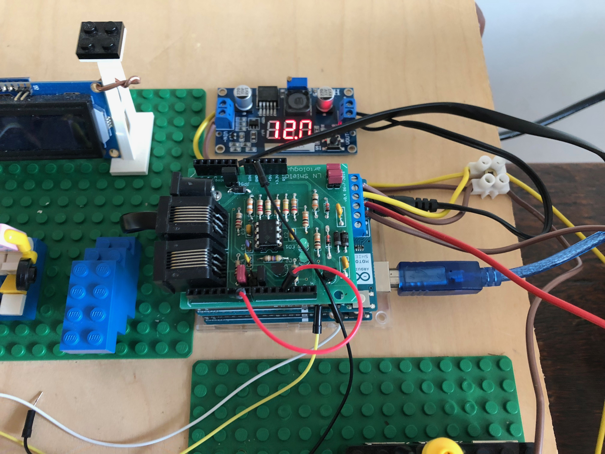
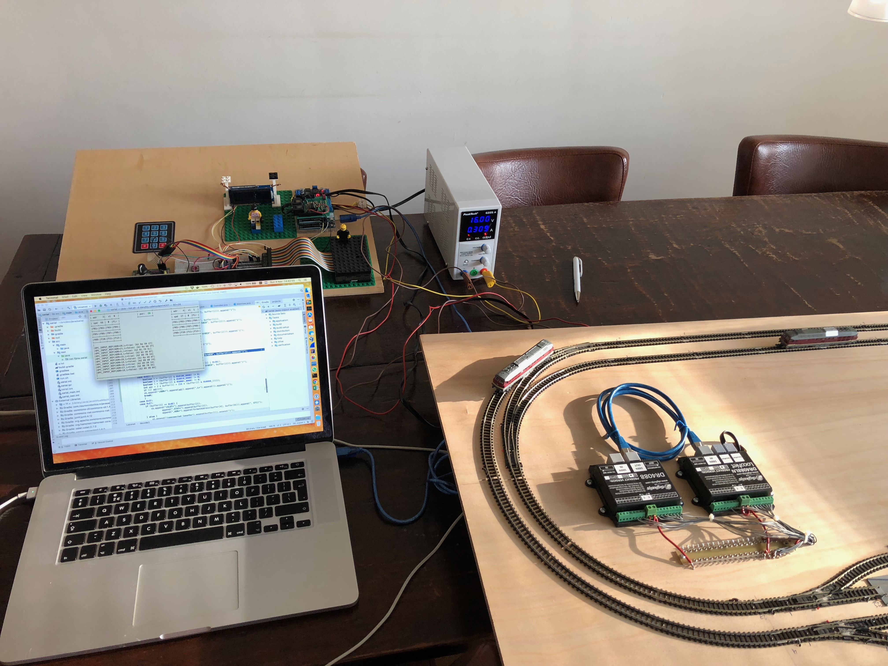

Arduino DCC+LocoNet
===================

This is heavily inspired by, though not a fork off, [DccPlusPlus](https://github.com/DccPlusPlus).

## What do we have:

- An Arduino
- A motorshield to boost logic-level DCC signals to something more beefy 
- A [FremoLNShield](http://nh-finescale.nl/fremo/dcc/fremo-ln-shield/FremoLNShield.html) to interface with Loconet

## What does it do:

The DCC sketch performs to main tasks:

 - Maintain a refresh buffer to generate a (real-time) DCC signal 
 - Proxy Loconet message to and from a host (via the serial port)

So, the sketch itself does not consitute a full DCC/Loconet command station. It needs to be complemented with a host application that does the heavy lifting (user interface, actual processing of Loconet messages, or even more intelligent control). Such a host application would

  - receive Loconet messages proxied by the DCC sketch, for example to detect sensor events
  - send Loconet messages trough the DCC sketch, for example to control switches
  - update slots in the refresh buffer to control the DCC signal send to the loco's on the track

That would make a basic DCC/Loconet control station. A java based host application "in progress" is included. It combines a funny eighties "TUI" interface with a contempary Model-View-Controller architecture:

There is also some experimental Python code for a Raspberry-based host application. Though this is still based on an older version of the Arduino sketch that used I2C instead of serial communication. It would be fun to revive this, as it could use all kind of LCD displays and rotary encoders to create something that actually looks like a command station. The Raspberry is on my setup, but not fully functional at the moment:

